# Bank Transaction System Project (Assignment)

## I. Project Overview
This project is a bank transaction system developed based on Spring Boot, which is used to handle business logic related to bank transactions, such as saving, querying, deleting, and modifying transaction records. All data is recorded in the cache.

## II. Introduction to the Technology Stack
### 1. Basic Frameworks
- **Spring Boot**: Version 3.4.1.
- **JUnit**: Used for writing and running unit tests.
- **Mockito**: Version 4.7.0, used to create and manage mock objects in unit tests for convenient isolation testing.

### 2. Integration Tools
- **Lombok**: Simplifies Java code through annotations, reducing the writing of boilerplate code such as getter and setter methods.
- **MapStruct**: Version 1.6.3, a code generator used to simplify the mapping conversion between Java Beans, improving code readability and maintainability.
- **Hutool**: Version 5.8.35, a Java utility library that provides a rich set of utility classes and methods, such as object utilities and string utilities, facilitating various operations during development.
- **SpringDoc**: Version 2.7.0, used to automatically generate and display documentation for RESTful APIs, making it convenient for developers and testers to view and test interfaces.

## III. Introduction to the Directory Structure
### Introduction to the General Business Directory
**`src/main/java/`**:
- **`com.bank.common.exception`**: General global exception handling, which can be used not only for the current transaction business but also for other future businesses.
- **`com.bank.common.vo`**: General return result class.

### Introduction to the Transaction Business Directory
**`src/main/java/`**:
- **`com.bank.trade.infrastructure`**: Basic settings for the transaction business. Here, "session" indicates that data is processed in the cache, and "mysql" indicates that data is processed in the database (not implemented in this case).
- **`com.bank.trade.domain`**: The domain layer of the transaction business. The domain layer is used to implement a complete command operation. In actual development, transactions and exceptions need to be handled at this layer (since no database is used in this case, transactions are not handled).
- **`com.bank.trade.application`**: The application layer of the transaction business. This layer is divided into two types of applications: command and query. In actual development, multi - threading and locks are all handled at this layer. This layer does not handle transactions, and multiple transactions will not be passed. Two commands with strong consistency should not be placed in one application.
- **`com.bank.trade.controller`**: The presentation layer of the transaction business. This layer is an entry layer, which serves as the entrance for external applications.

### Other Notes
- For other subsequent businesses, just like the transaction business, a complete four - layer structure should be established.
- Each business should provide a custom exception enumeration class for the current business (similar to [TradeResponseCode.java](src%2Fmain%2Fjava%2Fcom%2Fbank%2Ftrade%2Fdomain%2Fexception%2FTradeResponseCode.java) in the transaction business), which should be as detailed as possible. This not only makes the interface robust enough but also provides more friendly and precise interaction prompts for users.

## IV. Run the Project on PC
### 1. Environment Requirements
- Java 21
- Maven

### 2. Steps
1. Clone the project to the local machine:
```bash
git clone https://github.com/wilbur-ltf/bank.git
```
2. Open the project in IntelliJ IDEA, and click the button in the upper - right corner as shown in the figure to start the project:
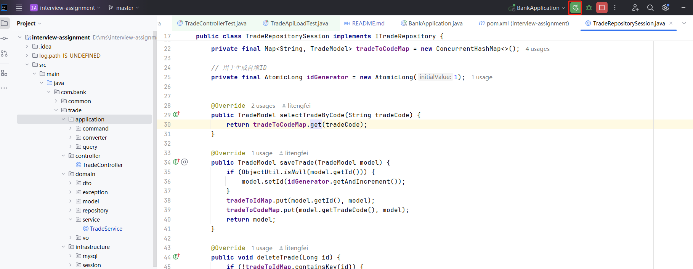

## V. Swagger Testing
### 1. Access Address
http://localhost:8080/swagger-ui/index.html
The effect is shown in the figure:
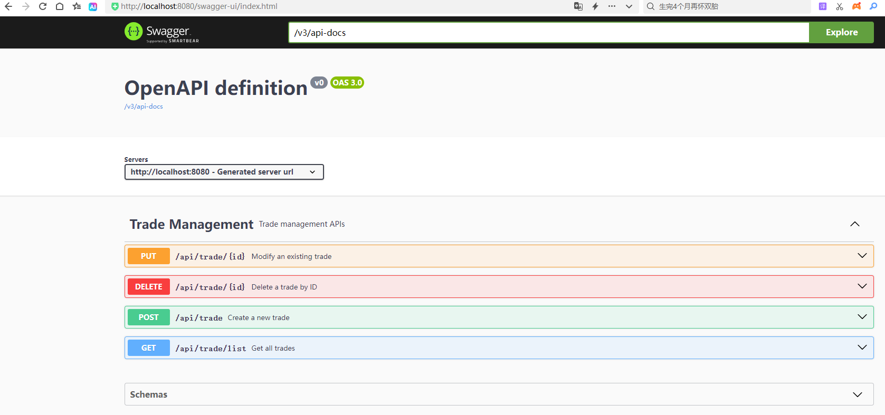
### 2. New Addition Test
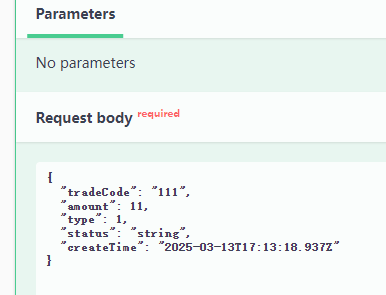
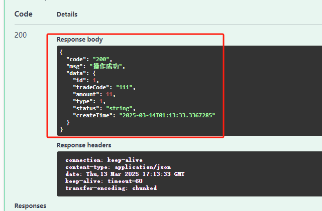
### 3. Modification Test
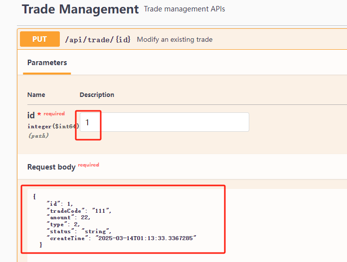
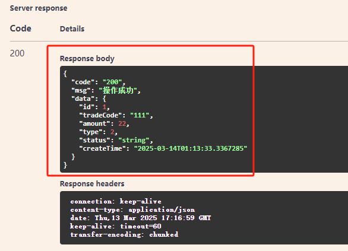
### 4. Query Test
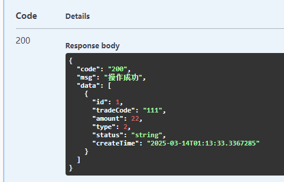
### 5. Deletion Test
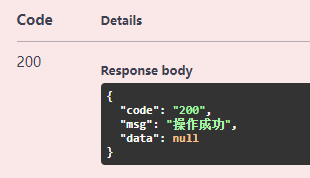
## V. Unit Testing
### 1. Location of the Test Class
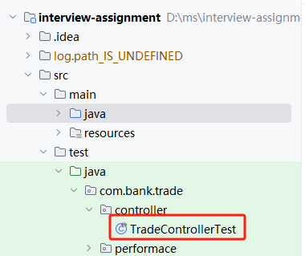
### 2. Testing Effect
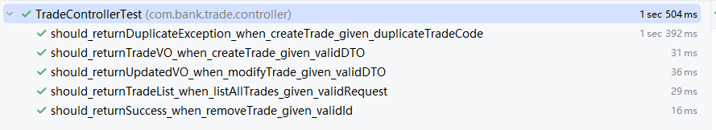
### 3. Instructions for What to Do (TODO) in Unit Testing
In actual development, it is necessary not only to provide unit tests for the controller but also for the application and domain layers. These unit tests are essential. Moreover, every exception branch should be covered. Since this part of the code is similar to the unit tests mentioned above, due to time constraints (there has been particularly heavy overtime work in the company recently), I haven't written them yet. I'm making this special note to explain the situation.  
## VI. Stress Testing
### 1. Location of the Test Class
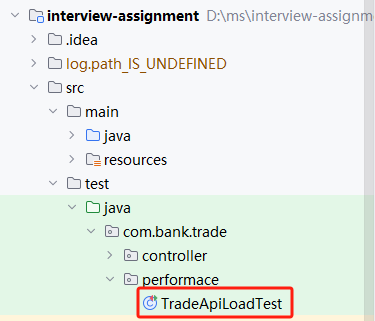
### 2. Testing Results of the Stress Test
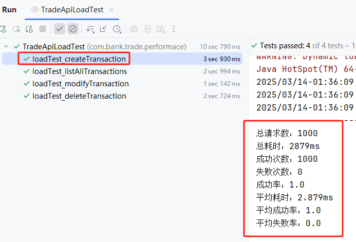

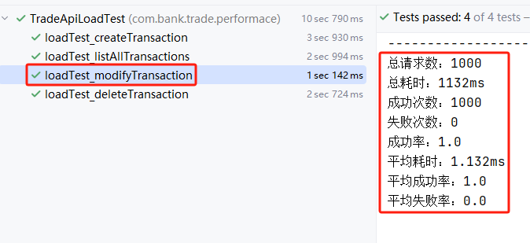
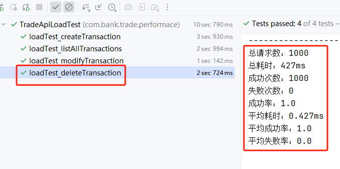
## VII. Project Deployment
### 1. Write the Dockfile. For details, please refer to [Dockerfile](Dockerfile).
The location is shown in the figure:
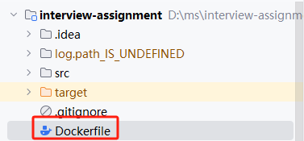
### 2. Install Docker
The steps are omitted here.
### 3. Build the container
docker build -t bank:1.0 .
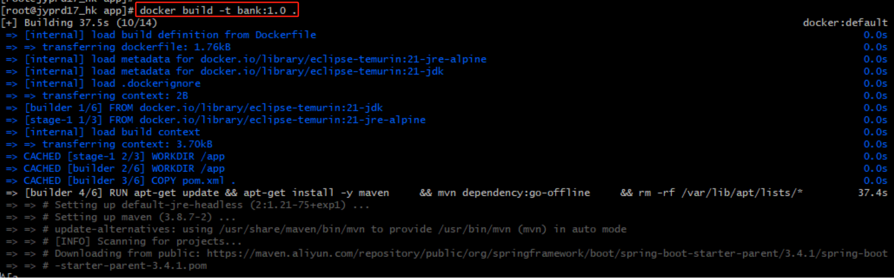
### 4. Start the container
docker run bank:1.0

## VIII. Other Instructions
### 1. Instructions on the Project's Extensibility
The four-layer structure of DDD (Domain-Driven Design) can maximally separate the technology stack (infrastructure layer) from the business (domain layer). According to the principle of open-closed, the domain layer is only responsible for calling interfaces and does not care about the used technology stack and data sources. This greatly enhances the extensibility of the code.
### 2. Instructions on the System's Concurrency
In the stress test, I used multithreading. In actual development, to improve the system's concurrency, in addition to using multithreading and improving the utilization rate of server resources, it is usually necessary to use methods such as caching and message queues. This part is not reflected in the current case, and I am also making this explanation. 
